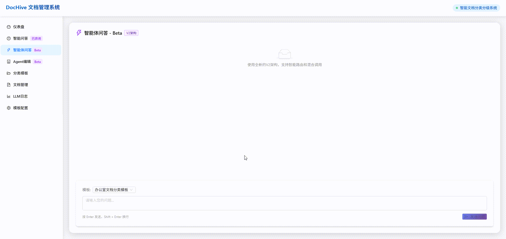
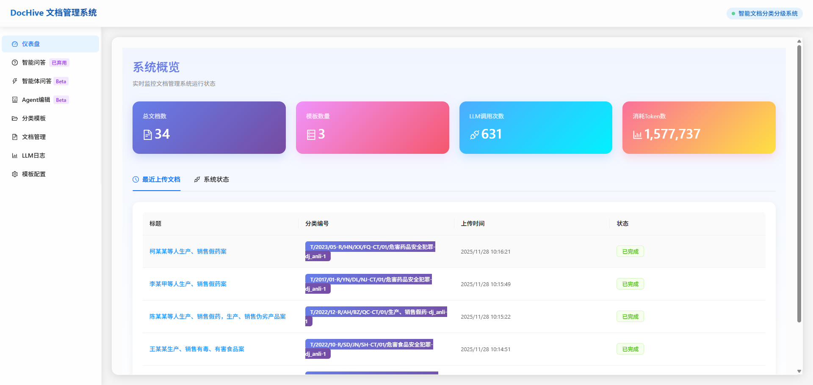
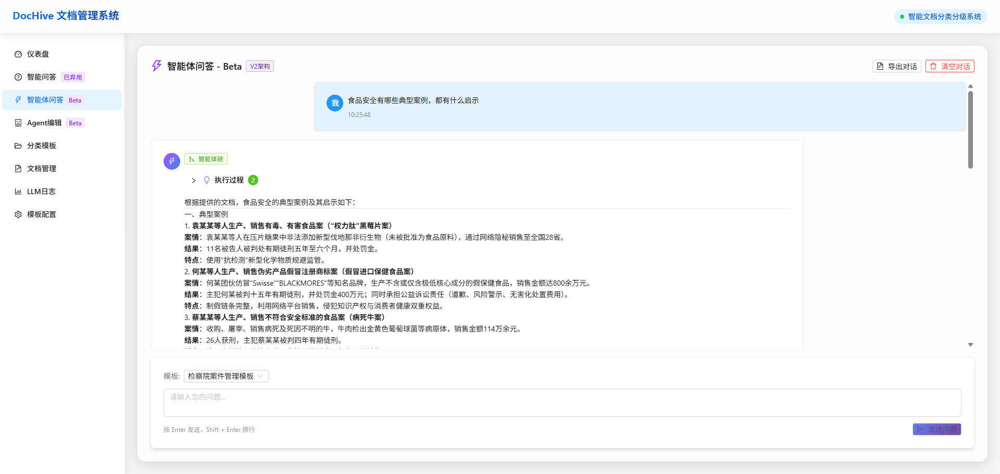
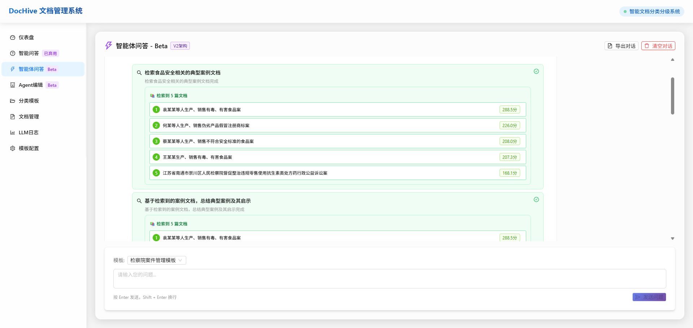
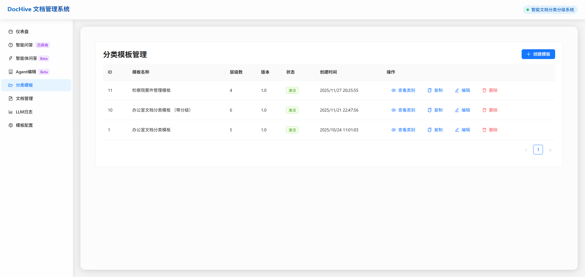
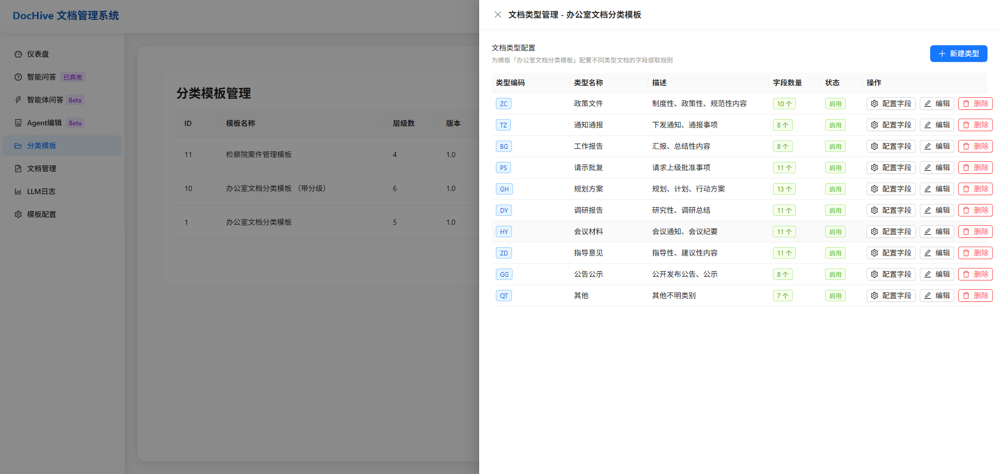
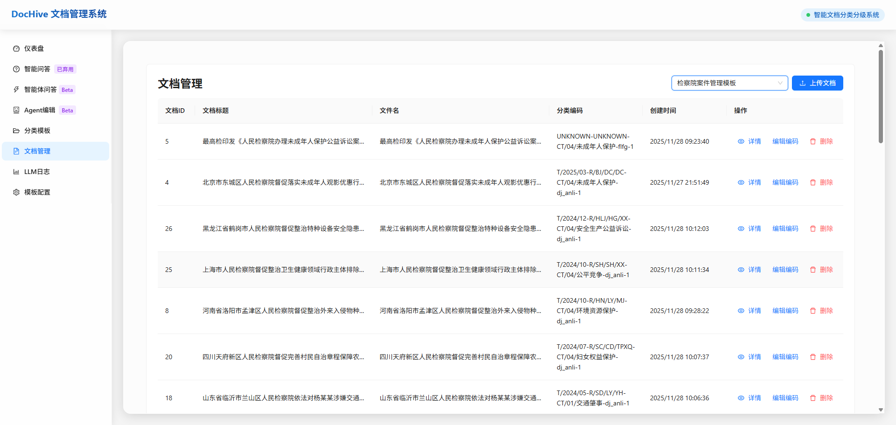
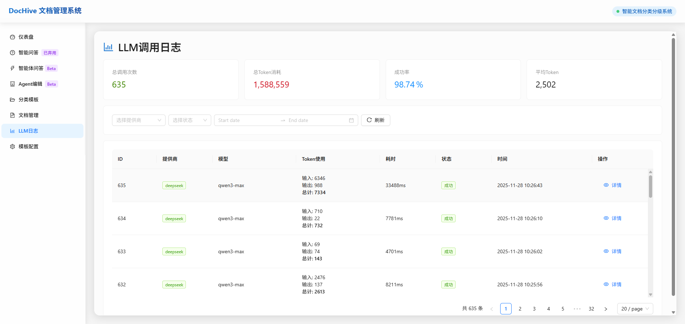
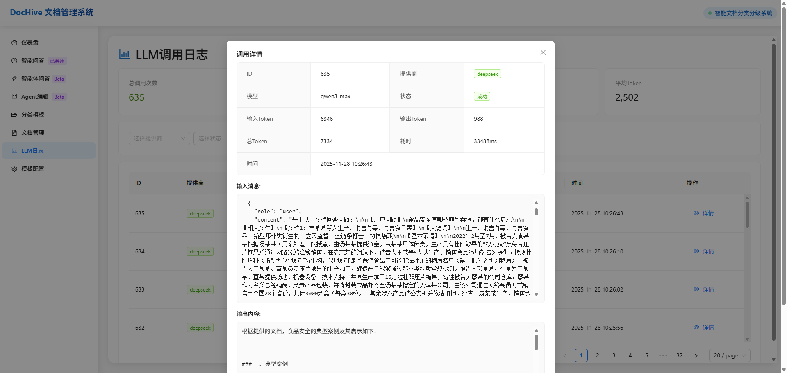

# DocHive - 智能文档分类分级系统

> 基于大语言模型的智能文档管理平台

[](LICENSE)
[](https://www.python.org/)
[](https://reactjs.org/)
[](https://fastapi.tiangolo.com/)

## 📋 项目简介

DocHive 是一个智能文档分类分级系统，通过大语言模型实现文档的自动分类、信息抽取、智能编号和全文检索。

### 核心思路

传统的 **RAG（Retrieval-Augmented Generation）** 实际上是一个相对粗糙的概念。在实践中，绝大多数文档类型（例如简历、报告、合同等）并不适合直接采用传统 RAG 进行处理。即便后续出现的 **GraphRAG** 等变体引入了"实体–关系"图的概念，也仅仅是在知识组织层面进行了扩展。对于缺乏显性实体的文档类型（如政策法规、技术规范、制度文件等），这些方法仍然难以解决检索性能差、上下文关联弱的问题。

在 2025 年 4 月，我提出过一个设想：**将所有非结构化文档转化为结构化数据进行处理。** 理由是：几乎所有类型的文档都围绕某种"关注对象"展开。只要能够准确抽取并索引这些关注信息，就可以在检索阶段快速锁定相关内容，从而显著提升 RAG 的准确性与响应效率。

接下来，我计划将这一"文档结构化"思路与 **分类分级体系** 相结合，以"结构化（或半结构化）文档"为核心，使文档具备更强的 **可比性** 与 **可检索性**。这不仅能优化 RAG 的信息召回效果，也为构建可解释、可控的知识语义体系奠定基础。

### 核心功能

- 🏷️ **自定义编码模板** - 支持多级分类层级设计
- 📄 **文档上传解析** - 支持 PDF、DOCX、TXT、Markdown 等多种格式
- 🤖 **智能分类引擎** - 基于 LLM 的文档自动分类
- 🔍 **信息抽取引擎** - 智能提取关键字段和结构化数据
- 🔢 **自动编号管理** - 规则化编号生成与索引
- 🔎 **多维度检索** - 支持全文检索、分类筛选、时间范围等

## 🏗️ 技术栈

### 后端
- **框架**: FastAPI
- **数据库**: SQLite/PostgreSQL/MySQL
- **搜索引擎**: Elasticsearch
- **对象存储**: MinIO
- **LLM**: OpenAI/DeepSeek

### 前端
- **框架**: React + TypeScript
- **UI 库**: Ant Design
- **状态管理**: Zustand
- **构建工具**: Vite

## 🚀 快速开始

### 使用 Docker Compose (推荐)

1. 克隆项目代码:
```bash
git clone https://github.com/AI-change-the-world/DocHive.git
cd DocHive
```

2. 进入 docker 目录并启动服务:
```bash
cd docker
docker-compose up -d
```

3. 等待服务启动完成，访问以下地址:
   - 前端界面: http://localhost:3000
   - 后端API: http://localhost:8000

### 开发环境启动

#### 后端
```bash
cd backend
pip install -r requirements.txt
python run.py
```

#### 前端
```bash
cd frontend
pnpm install
pnpm dev
```

## 📚 详细文档

有关项目的详细信息，请参阅以下文档：

- [系统架构](docs/architecture.md) - 了解系统的整体架构和技术栈
- [部署指南](docs/deployment.md) - 学习如何部署和配置系统
- [用户使用手册](docs/user-guide.md) - 了解如何使用系统功能
- [开发指南](docs/development.md) - 了解如何进行二次开发
- [API 参考文档](docs/api-reference.md) - 查看详细的 API 接口说明

## 🐱 一些截图

- 知识库问答
	
	

  - 自然语言转Agent

  
	
- 系统截图

  |  |       |
  | ------------------------------------- | ------------------------------------- |
  |       |  |
  |  |        |
  |       |       |


## ✍🏻 TODO list

- [ ] 需要支持长时记忆，现在智能体记忆是单个session有效，我想实现某些记忆长时间生效的功能（long term memory）
  - [ ] 现在大模型操作记录，只记录了问答内容，没记录哪个模块的，这个需要分清楚，后续可以作为agent调优数据
  - [ ] 现在工具，没有用户反馈机制，比如用户的一个query进来，最后会经过多个工具，但是每个工具都缺少用户反馈入口。有了这个反馈，可以基于long term memory再次对agent进行调优
- [ ] 自然语言解析将采用“大模型逐步规划 + 条件跳转（goto/if-else）”的混合方式实现：用户输入的自然语言首先被解析成一个可执行的中间任务图（Task Graph），图中节点由基础工具调用（ToolCall）、简单控制流（If, Goto）组成，不实现通用 Loop，但支持通过 Goto 实现有限次数的循环或重试。每执行一步后，系统都会将执行上下文、结果与剩余任务再次交给大模型做“动态再规划”（Replan），用于纠错、补充遗漏步骤、合并逻辑或引导下一步行为，从而避免静态计划难以覆盖全部情况。整个 Agent 系统以“状态机 + 工具调用 + 大模型监督”的方式运行：状态机负责最小控制流（task pointer、goto）、工具完成原子操作，大模型负责解释用户意图、生成计划与持续优化，使其兼具可控性、灵活性和扩展性。该架构可进一步扩展，未来如果要支持 Loop/多流程协作，只需扩展 Task Graph 的节点类型即可。（完全重构）

  


## 🤝 贡献

欢迎提交 Issue 和 Pull Request!

## 📄 许可证

```TODO```

---

**⭐ 如果这个项目对您有帮助,请给一个 Star!** ⭐

**最后更新**: 2025-11-17  
**版本**: v1.2.0
