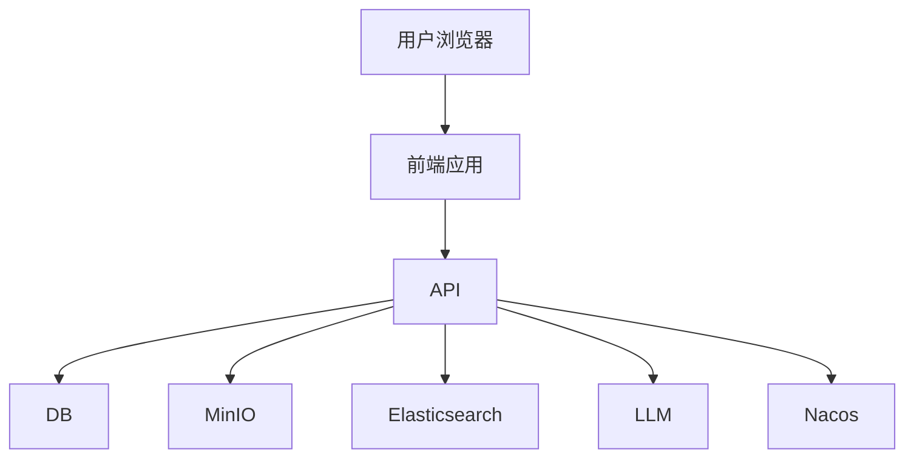

# 系统架构

## 整体架构

DocHive 采用前后端分离的架构设计，后端基于 FastAPI 框架，前端基于 React 框架。

## 技术栈

### 后端技术栈

- **框架**: FastAPI 0.119.1
- **数据库**: SQLite (开发环境) / PostgreSQL / MySQL (生产环境)
- **搜索引擎**: Elasticsearch 9.2.1
- **对象存储**: MinIO
- **LLM**: OpenAI / DeepSeek
- **配置中心**: Nacos
- **任务队列**: Celery + Redis (计划中)

### 前端技术栈

- **框架**: React 18.3 + TypeScript 5.9
- **UI 库**: Ant Design 5.27
- **路由**: React Router DOM 7.9
- **状态管理**: Zustand 4.5
- **构建工具**: Vite 7.1

## 微服务架构

系统采用微服务架构设计，各组件职责分明：

1. **API 服务层**: 提供 RESTful API 接口
2. **业务逻辑层**: 处理核心业务逻辑
3. **数据访问层**: 负责数据持久化
4. **搜索引擎层**: 提供文档检索能力
5. **对象存储层**: 存储文档文件
6. **AI 服务层**: 提供智能分类和信息抽取能力
7. **配置管理层**: 统一配置管理

## 数据流向

1. 用户通过前端界面上传文档
2. 后端接收文档并存储到对象存储
3. 文档内容被解析并提取文本
4. 利用 LLM 进行智能分类和信息抽取
5. 结构化数据存储到数据库
6. 文档内容索引到搜索引擎
7. 用户可通过前端界面检索和浏览文档